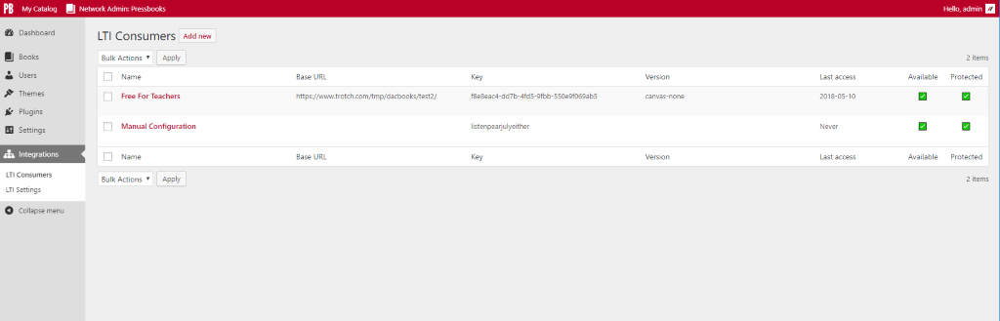
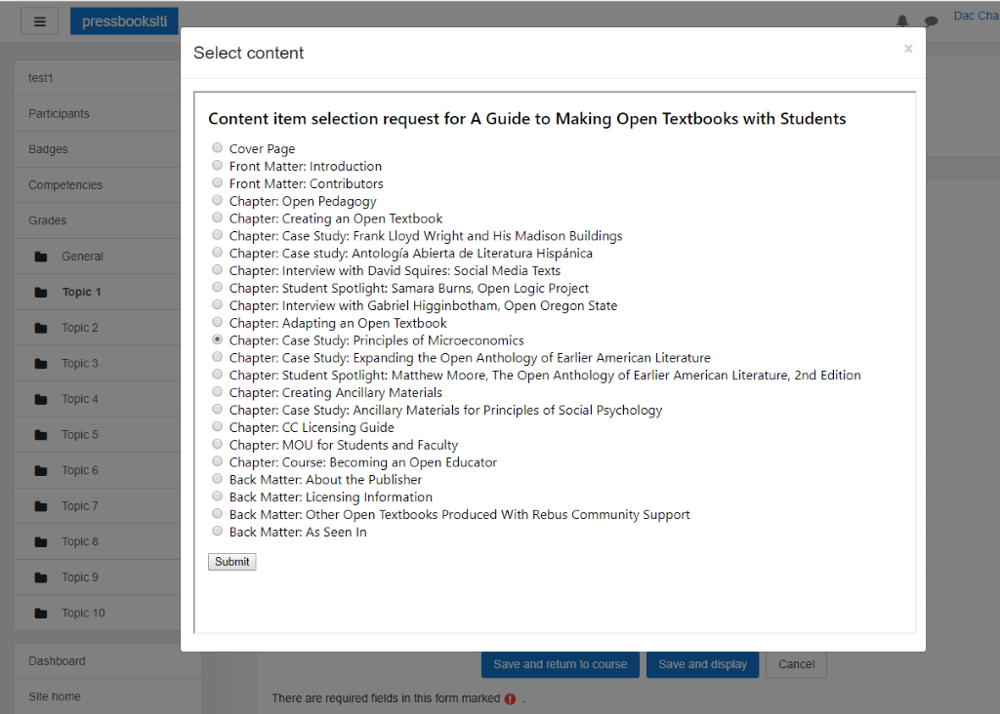

# Pressbooks LTI Provider 
**Contributors:** conner_bw, greatislander  
**Tags:** pressbooks, lti, lms  
**Requires at least:** 5.2.1  
**Tested up to:** 5.2.1  
**Stable tag:** 1.3.1  
**License:** GPLv3 or later  
**License URI:** https://www.gnu.org/licenses/gpl-3.0.html  

This plugin turns Pressbooks into an LTI provider.


## Description 

[](https://packagist.org/packages/pressbooks/pressbooks-lti-provider) [](https://github.com/pressbooks/pressbooks-lti-provider/releases) [](https://travis-ci.org/pressbooks/pressbooks-lti-provider/) [](https://codecov.io/gh/pressbooks/pressbooks-lti-provider)

A plugin that turn Pressbooks into an [LTI Provider](https://en.wikipedia.org/wiki/Learning_Tools_Interoperability).

This plugin is built on top of a (forked and maintained) IMS Global Learning Consortium provided [LTI-Tool-Provider-Library-PHP](https://github.com/Izumi-kun/LTI-Tool-Provider-Library-PHP) abstraction
layer. It includes support for LTI 1.1 and the unofficial extensions to LTI 1.0, as well as the registration process and services of LTI 2.0.


## Installation 

```
composer require pressbooks/pressbooks-lti-provider
```

Or, download the latest version from the releases page and unzip it into your WordPress plugin directory): https://github.com/pressbooks/pressbooks-lti-provider/releases

Then, activate and configure the plugin at the Network level.

Read the integrations documentation for more info: https://docs.pressbooks.org/integrations/lti/


## Troubleshooting 

+ If the user's web browser does not allow 3rd Party Cookies, then logins will not work when Pressbooks is in an iframe.

+ If the web server has incorrect `X-Frame-Options` settings, then iframes will refuse to display. [More info.](https://developer.mozilla.org/en-US/docs/Web/HTTP/Headers/X-Frame-Options)

+ This plugin requires [PDO for MySQL](http://php.net/manual/en/ref.pdo-mysql.php). These drivers are usually installed by default when installing MySQL packages for PHP. If you have
Pressbooks running, then PDO should already be installed. If for some reason the PDO drivers are missing, install them.


## Deep Linking 

Connect URL (LTI 2 Registration URL)
> https://site/book/format/lti

Book cover page
> https://site/book/format/lti/launch

Post_id
> https://site/book/format/lti/launch/123

Post_type + Post_name
> https://site/book/format/lti/launch/front-matter/introduction

Root site compatibility:
> https://site/format/lti/BOOK_ID?page_id=123

> https://site/format/lti/BOOK_ID/launch/123

> https://site/format/lti/BOOK_ID/launch/front-matter/introduction


## ContentItemSelectionRequest (Automatic Configuration) 

Pressbooks supports incoming content-item requests for media type values of `application/vnd.ims.lti.v1.ltilink`.

This feature allows course designers to select which chapter they want to display from inside their LMS.

When configuring, the Launch URL will be something like `https://site/book/format/lti` where `https://site/book` is the URL to your book. Setup instructions follow:

Note: Automatic configuration is a feature of the LTI 2.0 specification. Support, usefulness, varies between Learning Management Systems.

### Moodle

First, whitelist the Tool Consumer domain in Pressbooks "LTI2 Registration Whitelist".

In Moodle go to: Site Administration -> Plugins -> Manage Tools -> Add tool. Paste in the Launch URL. Follow the configuration steps.

Once configured, you can pick a chapter when adding an external tool by clicking "Select Content".

### Canvas

Settings -> Apps -> View App Configuration -> +App. Configure using the "Paste XML Configuration Type" with the following XML snippet, making sure to replace `https://site/book/format/lti` with your Launch URL:

```
<?xml version="1.0" encoding="UTF-8"?>
<cartridge_basiclti_link xmlns="http://www.imsglobal.org/xsd/imslticc_v1p0" xmlns:blti="http://www.imsglobal.org/xsd/imsbasiclti_v1p0" xmlns:lticm="http://www.imsglobal.org/xsd/imslticm_v1p0" xmlns:lticp="http://www.imsglobal.org/xsd/imslticp_v1p0" xmlns:xsi="http://www.w3.org/2001/XMLSchema-instance" xsi:schemaLocation="http://www.imsglobal.org/xsd/imslticc_v1p0 http://www.imsglobal.org/xsd/lti/ltiv1p0/imslticc_v1p0.xsd http://www.imsglobal.org/xsd/imsbasiclti_v1p0 http://www.imsglobal.org/xsd/lti/ltiv1p0/imsbasiclti_v1p0p1.xsd http://www.imsglobal.org/xsd/imslticm_v1p0 http://www.imsglobal.org/xsd/lti/ltiv1p0/imslticm_v1p0.xsd http://www.imsglobal.org/xsd/imslticp_v1p0 http://www.imsglobal.org/xsd/lti/ltiv1p0/imslticp_v1p0.xsd">
  <blti:title>Pressbooks Book</blti:title>
  <blti:description>This is a Pressbooks Book</blti:description>
  <blti:launch_url>https://site/book/format/lti</blti:launch_url>
  <blti:extensions platform="canvas.instructure.com">
    <lticm:property name="privacy_level">email_only</lticm:property>
    <lticm:options name="link_selection">
      <lticm:property name="message_type">ContentItemSelectionRequest</lticm:property>
      <lticm:property name="url">https://site/book/format/lti</lticm:property>
    </lticm:options>
    <lticm:property name="selection_height">600</lticm:property>
    <lticm:property name="selection_width">800</lticm:property>
  </blti:extensions>
</cartridge_basiclti_link>
```

[More info.](https://github.com/instructure/canvas-lms/blob/master/doc/api/content_item.md)

### Sakai

Click on the Site Info tool in the left navigation area. Click on the External Tools tab. Click on Install LTI 1.1 link.

When entering the information, make sure to select: Allow the tool to be launched as a link, Allow external tool to configure itself, and Allow the tool to be used from the rich content editor to select content.

Once configured, use "Launch External Tool Configuration" when adding an External Tool.

### Blackboard

System Admin -> LTI Tool Providers -> Register Provider Domain. Configure accordingly.

Next, from the options menu (little arrow next to the configured domain) select: Manage Placements, then Create Placement.

When entering the information make sure to select: Course content tool and Supports deep linking.

The placement will be available in your Course the under Build Content menu.


## Common Cartridge 

Allows users to export books as "Thin" Common Cartridge zip files. Supports CC 1.1, 1.2 and 1.3. Produces .imscc (zip) files with LTI links. Some notes:

 + Files passed the IMS Common Cartridge Validator.
 + Moodle was able to import CC 1.1 ([because there's no code to import 1.2 or 1.3 ?!](https://github.com/moodle/moodle/tree/master/backup/converter))
 + Canvas was able to import CC 1.1, 1.2, and 1.3.
 + Sakai imports but didn't know what to do with the LTI links? Only empty Frontmatter, Main Body, Backmatter appeared under Lessons. The rest of the content appeared as unusable XML files under Resources. Fixed in 12.4. [See this bug report for resolution.](https://jira.sakaiproject.org/browse/SAK-40082)
 + Blackboard was able to import CC 1.1 and 1.2.

Thanks to [Ed Beck](http://ed-beck.com/), [Bracken Mosbacker](https://github.com/lumenlearning/candela-thin-exports), [Brad Payne](https://github.com/BCcampus/pressbooks-cc-export), [Steel Wagstaff](https://github.com/SteelWagstaff/candela-thin-exports) and everyone in https://pressbooks.community/ who helped us get this working.


## Screenshots 






## Changelog 

### 1.3.1 
* See: https://github.com/pressbooks/pressbooks-lti-provider/releases/tag/1.3.1
* Full release history available at: https://github.com/pressbooks/pressbooks-lti-provider/releases


## Upgrade Notice 

### 1.3.1 
Pressbooks LTI Provider requires Pressbooks >= 5.8.1
