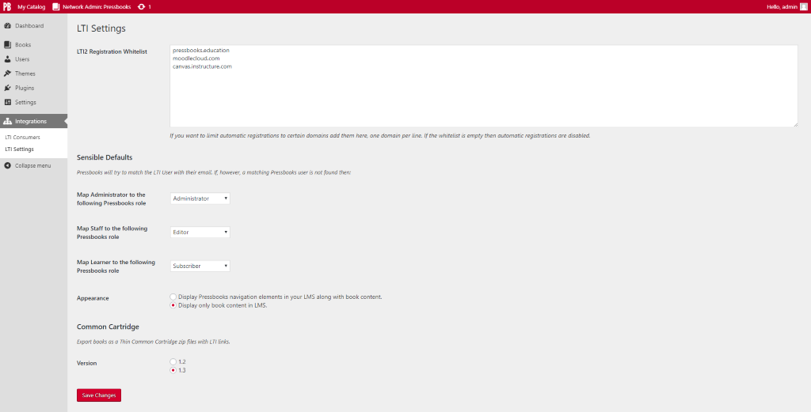

# Pressbooks LTI Provider 
**Contributors:** conner_bw, greatislander  
**Donate link:** https://opencollective.com/pressbooks/  
**Tags:** pressbooks, lti, lms  
**Requires at least:** 4.9.5  
**Tested up to:** 4.9.5  
**Stable tag:** 0.2.0  
**License:** GPLv3 or later  
**License URI:** https://www.gnu.org/licenses/gpl-3.0.html  

This plugin turns Pressbooks into an LTI provider.


## Description 

[](https://packagist.org/packages/pressbooks/pressbooks-lti-provider) [](https://github.com/pressbooks/pressbooks-lti-provider/releases) [](https://travis-ci.org/pressbooks/pressbooks-lti-provider/) [](https://codecov.io/gh/pressbooks/pressbooks-lti-provider)

A plugin that turn Pressbooks into an [LTI Provider](https://en.wikipedia.org/wiki/Learning_Tools_Interoperability).

This plugin is built on top of an IMS Global Learning Consortium provided [LTI-Tool-Provider-Library-PHP](https://github.com/Izumi-kun/LTI-Tool-Provider-Library-PHP) abstraction
layer. It includes support for LTI 1.1 and the unofficial extensions to LTI 1.0, as well as the registration process and services of LTI 2.0.


## Installation 

```
composer require pressbooks/pressbooks-lti-provider
```

Or, download the latest version from the releases page and unzip it into your WordPress plugin directory): https://github.com/pressbooks/pressbooks-lti-provider/releases

Then, activate and configure the plugin at the Network level.


## Troubleshooting 

+ If the user's web browser does not allow 3rd Party Cookies, then logins will not work when Pressbooks is in an iframe.

+ This plugin requires [PDO for MySQL](http://php.net/manual/en/ref.pdo-mysql.php). These drivers are usually installed by default when installing MySQL packages for PHP. If you have
Pressbooks running, then PDO should already be installed. If for some reason the PDO drivers are missing, install them.


## Deep Linking 

Connect URL (LTI 2 Registration URL)
> https://site/book/format/lti

Book cover page
> https://site/book/format/lti/launch

Post_id
> https://site/book/format/lti/launch/123

Post_type + Post_name
> https://site/book/format/lti/launch/front-matter/introduction

TODO?
> https://site/book/format/lti/launch/Hello%20World

> Candela style root URLs?


## Screenshots 





## Changelog 


### 0.2.0 
* Demo for Open source Slack channel.


### 0.1.0 
* Initial scaffold.


## Upgrade Notice 

Pressbooks LTI Provider requires Pressbooks >= 5.3.0 and WordPress >= 4.9.5.
